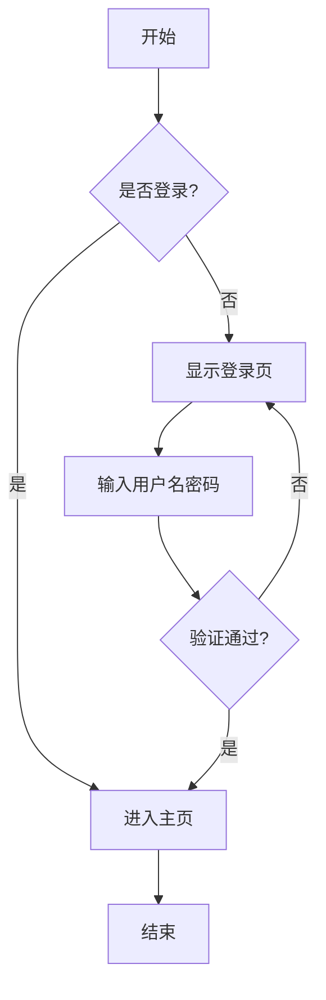
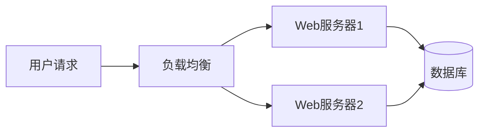
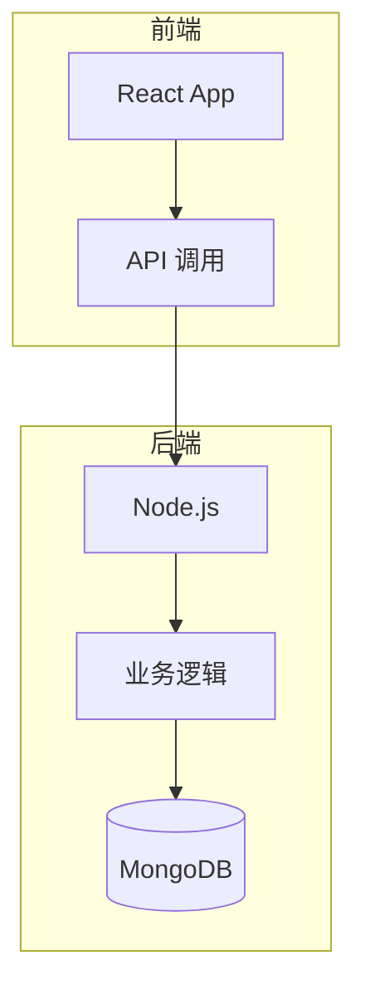
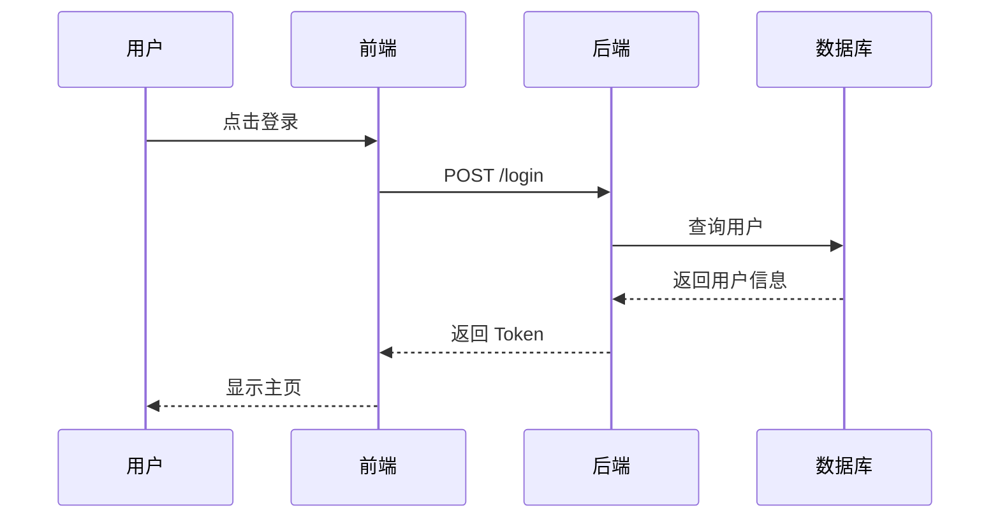

# Flowchart 演示文档

这是一个演示 **Mermaid Flowchart** 渲染功能的 Markdown 文档。

## 基本流程图

下面是一个简单的流程图示例：



## 水平流程图



## 带样式的流程图



## 普通代码块

普通代码块不会被当作流程图渲染：

```javascript
function hello() {
  console.log('Hello, World!');
}
```

## 序列图示例



## 结语

以上演示了 MD Reader 对 Mermaid 图表的支持。目前支持：

- ✅ Flowchart（流程图）
- ✅ Sequence Diagram（序列图）
- ✅ Class Diagram（类图）
- ✅ State Diagram（状态图）
- ✅ 更多 Mermaid 图表类型...

享受阅读！📖
