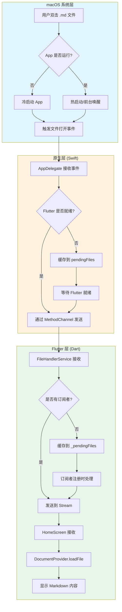
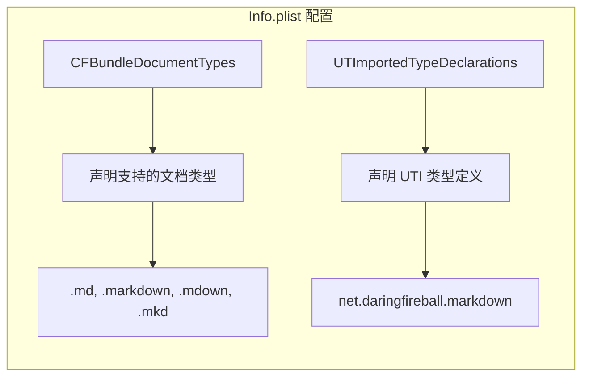
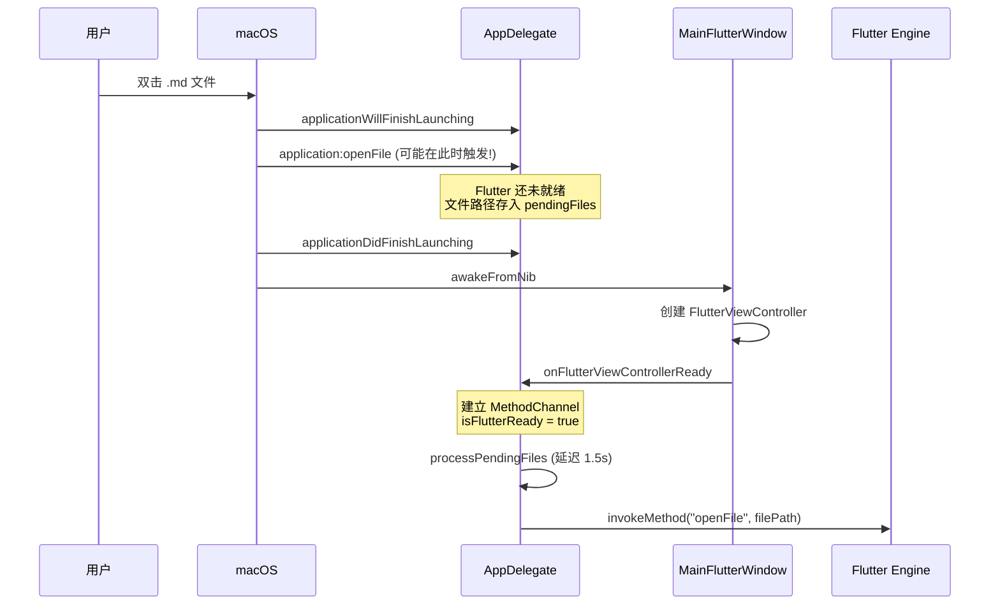
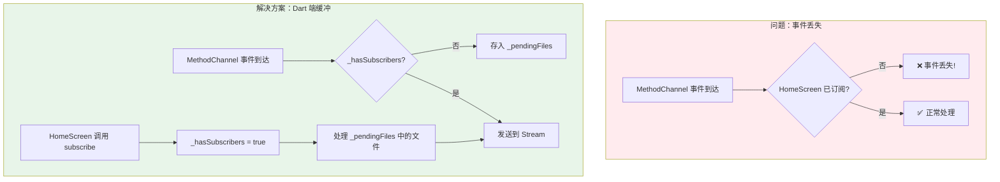
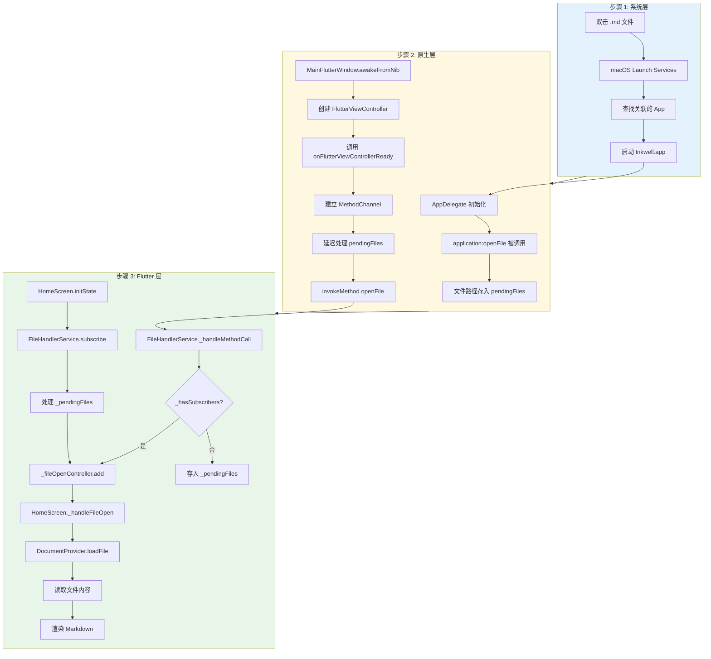
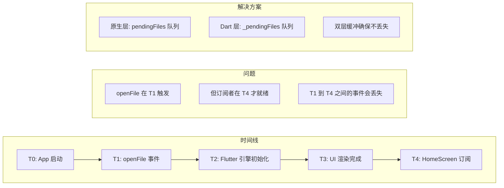
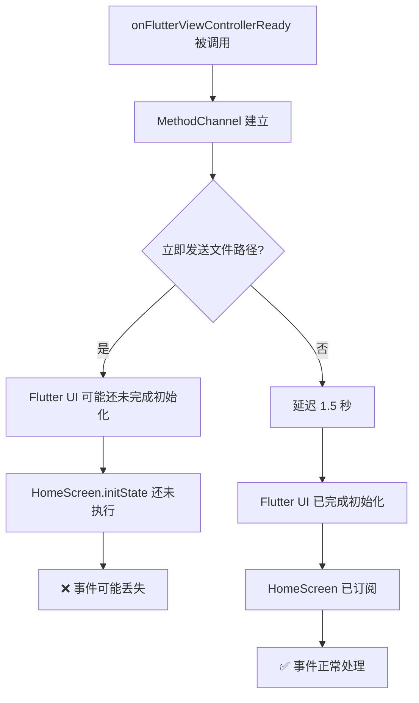
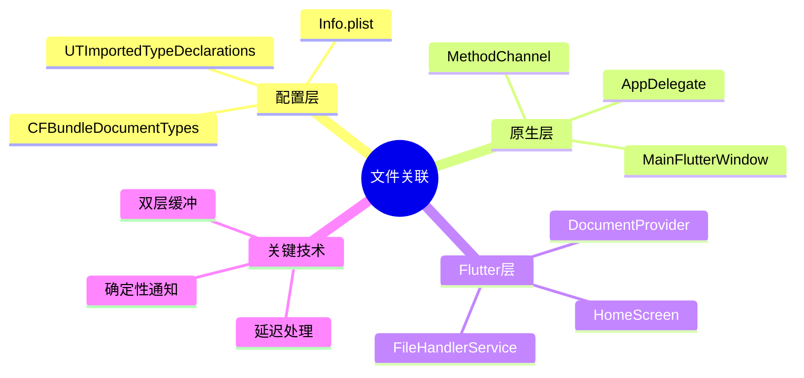

# macOS 文件关联技术方案：双击 .md 文件用 Flutter App 打开

## 概述

本文档详细介绍如何让 Flutter macOS 应用支持双击 `.md` 文件直接打开并显示内容。这涉及到 macOS 的文件关联机制、原生层与 Flutter 层的通信，以及冷启动时的事件处理。

---

## 整体架构



---

## 关键组件

### 1. Info.plist 配置

文件关联的基础是在 `Info.plist` 中声明应用支持的文件类型：



**配置内容：**

```xml
<!-- 声明应用可以打开的文档类型 -->
<key>CFBundleDocumentTypes</key>
<array>
    <dict>
        <key>CFBundleTypeName</key>
        <string>Markdown Document</string>
        <key>CFBundleTypeRole</key>
        <string>Viewer</string>
        <key>LSHandlerRank</key>
        <string>Alternate</string>
        <key>LSItemContentTypes</key>
        <array>
            <string>net.daringfireball.markdown</string>
            <string>public.plain-text</string>
        </array>
        <key>CFBundleTypeExtensions</key>
        <array>
            <string>md</string>
            <string>markdown</string>
            <string>mdown</string>
            <string>mkd</string>
        </array>
    </dict>
</array>

<!-- 声明 UTI 类型（如果系统未定义） -->
<key>UTImportedTypeDeclarations</key>
<array>
    <dict>
        <key>UTTypeIdentifier</key>
        <string>net.daringfireball.markdown</string>
        <key>UTTypeDescription</key>
        <string>Markdown Document</string>
        <key>UTTypeConformsTo</key>
        <array>
            <string>public.plain-text</string>
        </array>
        <key>UTTypeTagSpecification</key>
        <dict>
            <key>public.filename-extension</key>
            <array>
                <string>md</string>
                <string>markdown</string>
            </array>
        </dict>
    </dict>
</array>
```

---

### 2. 原生层实现 (Swift)

#### 2.1 时序问题



#### 2.2 AppDelegate.swift

**核心职责：**
- 接收 macOS 的文件打开事件
- 管理待处理文件队列
- 与 Flutter 层建立通信

```swift
import Cocoa
import FlutterMacOS

@main
class AppDelegate: FlutterAppDelegate {
    private var methodChannel: FlutterMethodChannel?
    private var pendingFiles: [String] = []
    private var isFlutterReady = false
    
    // 文件打开事件处理（支持多种触发方式）
    
    // 方式1: 单文件打开（旧 API）
    override func application(_ sender: NSApplication, openFile filename: String) -> Bool {
        handleOpenFile(filename)
        return true
    }
    
    // 方式2: 多文件打开
    override func application(_ sender: NSApplication, openFiles filenames: [String]) {
        for filename in filenames {
            handleOpenFile(filename)
        }
        NSApp.reply(toOpenOrPrint: .success)
    }
    
    // 方式3: URL 方式打开（macOS 13+ 推荐）
    override func application(_ application: NSApplication, open urls: [URL]) {
        for url in urls {
            if url.isFileURL {
                handleOpenFile(url.path)
            }
        }
    }
    
    // 统一的文件处理逻辑
    private func handleOpenFile(_ filename: String) {
        let fileUrl = URL(fileURLWithPath: filename).absoluteString
        
        if isFlutterReady, let channel = methodChannel {
            // Flutter 已就绪，立即发送
            channel.invokeMethod("openFile", arguments: fileUrl)
        } else {
            // Flutter 未就绪，加入队列
            pendingFiles.append(fileUrl)
        }
    }
    
    // 由 MainFlutterWindow 调用
    func onFlutterViewControllerReady(_ controller: FlutterViewController) {
        methodChannel = FlutterMethodChannel(
            name: "com.inkwell/file_handler",
            binaryMessenger: controller.engine.binaryMessenger
        )
        isFlutterReady = true
        processPendingFiles()
    }
    
    private func processPendingFiles() {
        guard !pendingFiles.isEmpty else { return }
        
        // 延迟处理，确保 Flutter UI 完全初始化
        DispatchQueue.main.asyncAfter(deadline: .now() + 1.5) {
            for filePath in self.pendingFiles {
                self.methodChannel?.invokeMethod("openFile", arguments: filePath)
            }
            self.pendingFiles.removeAll()
        }
    }
}
```

#### 2.3 MainFlutterWindow.swift

**核心职责：**
- 创建 FlutterViewController
- 通知 AppDelegate Flutter 已就绪

```swift
import Cocoa
import FlutterMacOS

class MainFlutterWindow: NSWindow {
    override func awakeFromNib() {
        let flutterViewController = FlutterViewController()
        self.contentViewController = flutterViewController
        
        RegisterGeneratedPlugins(registry: flutterViewController)
        
        // 关键：通知 AppDelegate
        if let appDelegate = NSApp.delegate as? AppDelegate {
            appDelegate.onFlutterViewControllerReady(flutterViewController)
        }
        
        super.awakeFromNib()
    }
}
```

---

### 3. Flutter 层实现 (Dart)

#### 3.1 双层缓冲机制



#### 3.2 FileHandlerService

```dart
import 'dart:async';
import 'package:flutter/services.dart';

class FileHandlerService {
    static const MethodChannel _channel = MethodChannel('com.inkwell/file_handler');
    static final StreamController<String> _fileOpenController = 
        StreamController<String>.broadcast();
    
    // Dart 端的缓冲队列
    static final List<String> _pendingFiles = [];
    static bool _hasSubscribers = false;
    
    static void initialize() {
        _channel.setMethodCallHandler(_handleMethodCall);
    }
    
    // 使用 subscribe 而不是直接访问 stream
    static StreamSubscription<String> subscribe(void Function(String) onData) {
        _hasSubscribers = true;
        
        // 处理在订阅之前到达的文件
        if (_pendingFiles.isNotEmpty) {
            Future.microtask(() {
                for (final filePath in _pendingFiles) {
                    onData(filePath);
                }
                _pendingFiles.clear();
            });
        }
        
        return _fileOpenController.stream.listen(onData);
    }
    
    static Future<dynamic> _handleMethodCall(MethodCall call) async {
        if (call.method == 'openFile') {
            String filePath = call.arguments as String;
            
            // 处理 file:// URL
            if (filePath.startsWith('file://')) {
                filePath = Uri.decodeComponent(filePath.substring(7));
            }
            
            if (!_hasSubscribers) {
                // 还没有订阅者，先缓存
                _pendingFiles.add(filePath);
            } else {
                _fileOpenController.add(filePath);
            }
        }
        return null;
    }
}
```

#### 3.3 HomeScreen 订阅

```dart
class _HomeScreenState extends State<HomeScreen> {
    StreamSubscription<String>? _fileOpenSubscription;
    
    @override
    void initState() {
        super.initState();
        // 使用 subscribe 方法，自动处理冷启动时的待处理文件
        _fileOpenSubscription = FileHandlerService.subscribe(_handleFileOpen);
    }
    
    void _handleFileOpen(String filePath) {
        if (!mounted) return;
        context.read<DocumentProvider>().loadFile(filePath);
    }
    
    @override
    void dispose() {
        _fileOpenSubscription?.cancel();
        super.dispose();
    }
}
```

---

## 完整数据流



---

## 关键问题与解决方案

### 问题 1: 冷启动时序问题



**解决方案：双层缓冲**

| 层级 | 缓冲机制 | 触发条件 |
|------|----------|----------|
| Swift 原生层 | `pendingFiles` 数组 | `isFlutterReady == false` |
| Dart Flutter 层 | `_pendingFiles` 列表 | `_hasSubscribers == false` |

### 问题 2: 获取 FlutterViewController 的时机

**之前的方法（不可靠）：**
```swift
// 轮询方式，可能在某些情况下失败
func setupMethodChannelWithRetry() {
    if let vc = mainFlutterWindow?.contentViewController as? FlutterViewController {
        // 使用 vc
    } else {
        // 重试
        DispatchQueue.main.asyncAfter(...) { self.setupMethodChannelWithRetry() }
    }
}
```

**改进后的方法（可靠）：**
```swift
// MainFlutterWindow 主动通知
class MainFlutterWindow: NSWindow {
    override func awakeFromNib() {
        let flutterViewController = FlutterViewController()
        // ...
        
        // 确定性地通知 AppDelegate
        if let appDelegate = NSApp.delegate as? AppDelegate {
            appDelegate.onFlutterViewControllerReady(flutterViewController)
        }
    }
}
```

### 问题 3: 延迟处理的必要性



---

## 调试技巧

### 1. 原生层日志

```swift
NSLog("[Inkwell] openFile called: \(filename)")
NSLog("[Inkwell] handleOpenFile: \(fileUrl), ready: \(isFlutterReady)")
```

查看日志：
```bash
log show --predicate 'eventMessage CONTAINS "[Inkwell]"' --last 5m
```

### 2. Flutter 层日志

```dart
debugPrint('[FileHandlerService] Received: ${call.method}');
debugPrint('[HomeScreen] Loading file: $filePath');
```

### 3. 验证文件关联

```bash
# 查看应用注册信息
/System/Library/Frameworks/CoreServices.framework/Versions/A/Frameworks/LaunchServices.framework/Versions/A/Support/lsregister -dump | grep -A 30 "Inkwell"

# 重新注册应用
lsregister -f /path/to/Inkwell.app

# 测试文件打开
open -a "Inkwell" /path/to/test.md
```

---

## 总结

实现 macOS 文件关联的核心要点：

1. **Info.plist 配置** - 声明支持的文件类型和 UTI
2. **原生层事件处理** - 覆盖所有可能的文件打开回调
3. **双层缓冲机制** - 确保冷启动时事件不丢失
4. **确定性通知** - 使用回调而非轮询获取 FlutterViewController
5. **适当延迟** - 给 Flutter UI 足够的初始化时间


